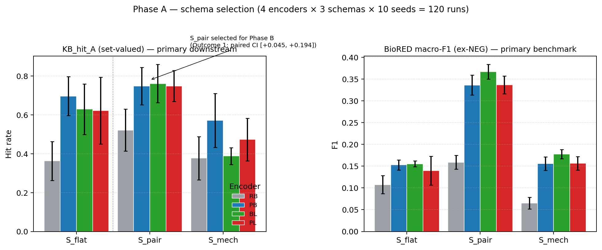
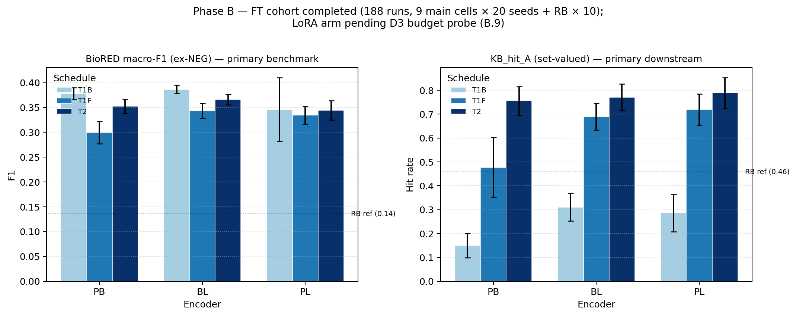
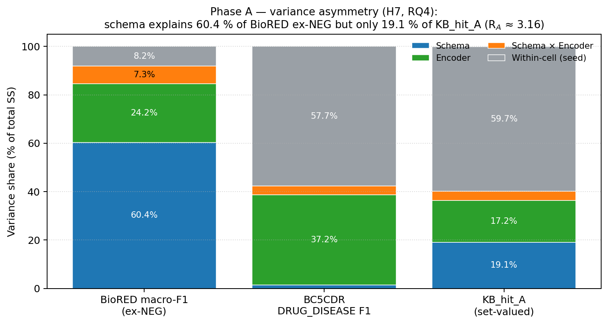
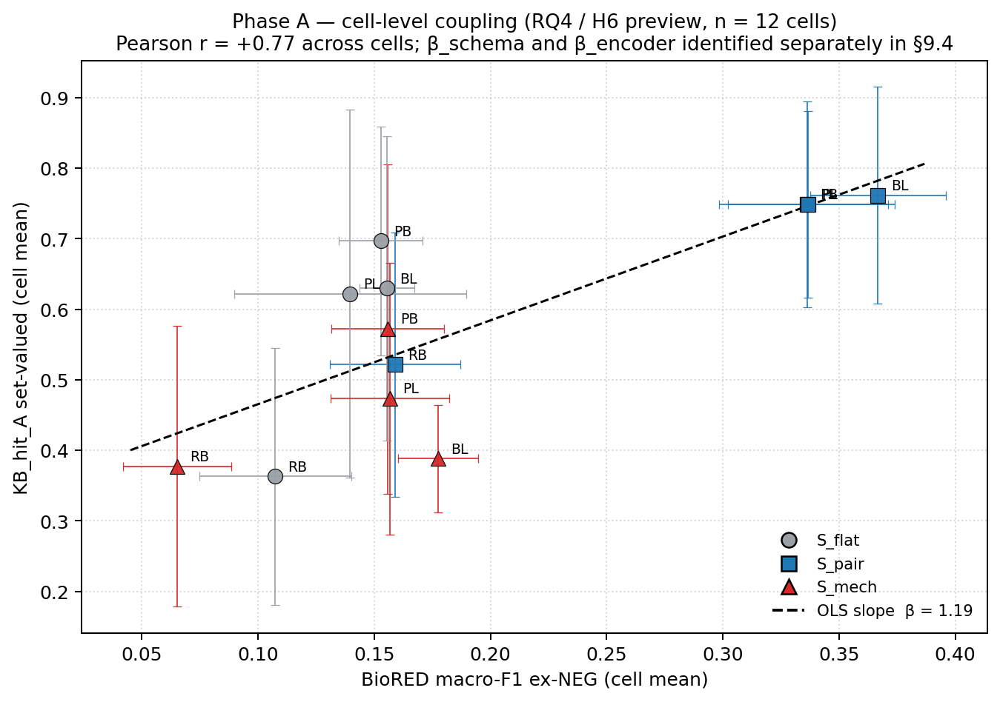
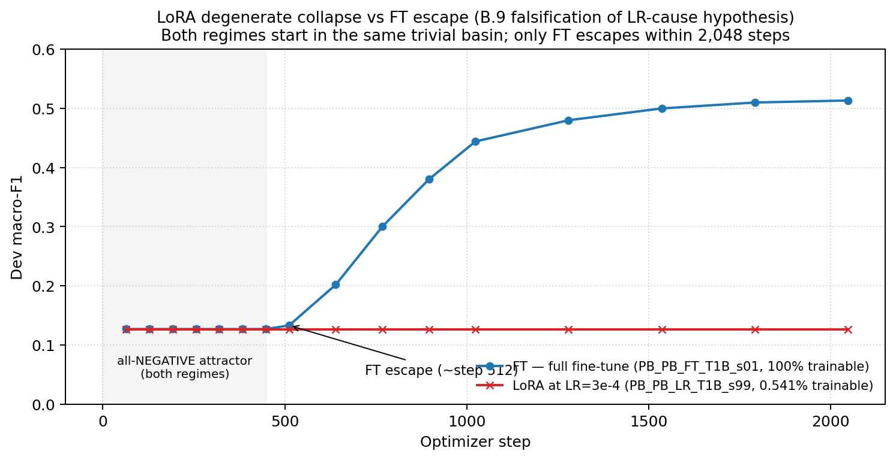

# Phase A 实验 / Phase B 计划 — 围绕 4 个 Research Questions 的进度汇报

> **SUPERSEDED (2026‑04‑30).**  This 2026‑04‑27 status snapshot was written
> before (i) the LoRA D3 verdict, (ii) the PL_FT_T2 seed-17/19 backfill,
> (iii) the 190-row post-lock Phase B aggregate, and (iv) the final
> H1/H2/H3/H6/H7/RQ3 analyses.  Use
> `report/RQ_final_results_report.md` as the current project status.
> This file is retained only as a historical progress report.

> 数据截止：2026‑04‑27（Appendix B.9 写入当日）。所有数字与表格均来自
> `fine_tuning_experiments/schema_exp/analysis/phase_a_analysis.{json,md}`、
> `fine_tuning_experiments/runs/phase_b/PB_*_FT_*/eval/phase_b_eval.json` 全套
> 188 个 FT 评测文件，以及 `paper_development_design_locked_v1.md` 中第 6.9 / 7
> / 9 节的预注册定义。所有图表脚本在 `report/scripts/` 下，原始数据在
> `report/data/` 下，可一键重跑。

---

## 0. 两份设计文档的关系（以及只看一份就够吗？）

项目根目录下有两份 `paper_development_design*.md`，**职责完全不同，不可互
相替代**：

| 文件 | 角色 | 含什么 | 何时改 |
|---|---|---|---|
| `paper_development_design_locked_v1.md` | **预注册冻结快照（pre‑registration lock）** | Parts 1‑11 的全部论文规范：故事 / RQ / 数据 / Schema / Trainer / Phase A 设计 + 结果 §6.9 / Phase B 设计 §7 / 统计分析 §9 / 论文章节 §10 / 已知弱点 §11；Appendix A 代码布局；Appendix B *锁定时为空* | **永远不改**。Body SHA 已写进文档自身，git tag `phase_b_prelock_v1`，commit `fba3d71`。任何字节级改动都会被发现。 |
| `paper_development_design.md` | **post‑lock 修订日志（amendment log）** | 仅含 Appendix B 的 B.1–B.9（再加一段简短引言说明 2026‑04‑24 文件丢失事件后如何重建）。Parts 1–11 不再保留 — 锁版已经是 single source of truth。 | 每次发生预注册偏离/重大基础设施变更时追加一行。当前最新条目 B.9（2026‑04‑27）。 |

**实际阅读建议**：

- **科学方法 / 设计 / 假设 / 统计计划 / Phase A 结果**：只看 `..._locked_v1.md` 就完整。
- **Phase A 之后所有"现实与计划的偏离"**（B.1 paired‑bootstrap、B.2 删除
  shared_multitask 轴 + 把每 cell 种子从 10 加到 20、B.7 源码删除事故 +
  LoRA trainer v2 重写、B.8/B.9 LoRA 退化诊断与 D3 budget probe 计划）：
  只看 `paper_development_design.md`。
- **要交付/汇报的"完整最新研究状态"**：必须**两份合起来读**——锁版给出
  pre‑registered 设计，工作版给出落地修订。这就是 pre‑registration 的
  正常工作流，不是冗余。

> **当前一致状态**：B.2 已把 Phase B 主因子设计从 360 → **180 主 run + 10
> RB ref + 20 LR retrain candidates**（3 encoder × 2 update × 3 schedule
> × 20 seeds），并把 H5（架构对比）下放为 deferred；B.9 暂停 LoRA arm
> 等待 D3 budget probe 结论。FT cohort 188/188 已完成训练 + 评测，进入
> 分析阶段。

---

## 1. 4 个 Research Question 与对应的实验地图

为了对齐汇报与论文章节、我把 RQ → 假设 → 实验 → 当前覆盖率全部铺成一张表。
"覆盖率"是预注册条件下"已可作出该 RQ 主张所需的证据"的当前比例（满分 100 %），
括号内是阻塞项。

| RQ | 一句话问题 | 主要支持假设 | Phase A 覆盖率 | Phase B 覆盖率 | 联合覆盖率 |
|---|---|---|---|---|---|
| **RQ1** 任务设定 | 在没有充分公开数据集的情况下，如何把 cancer assertion extraction 操作化？ | （非测试性，描述类） | **100 %** —§2 数据清单 + §3 三个 schema + §6.9.5 active‑head + §6.9.2 Outcome 1（S_pair） | n/a | **完成可写** |
| **RQ2** 训练 / 泛化 | 哪些训练配置最能从 dev 推广到 held‑out external benchmark？ | H1（PL>{PB,BL}）、H2（multi‑corpus T1>BioRED‑only）、H3（T1→T2 staged>T1_flat）、H4（FT vs LoRA）、H5（pipeline≈shared‑MT；deferred） | n/a（Phase A 只跑了 anchor config） | **FT 部分 ≈ 67 %** — 9 个 FT cell × 20 seeds 完整；**H1/H2/H3 全部 testable**。**H4 阻塞 D3**（B.9）。**H5 已 deferred**（B.2）。 | **≈ 60 %**（H1‑H3 可以现在就 finalize；H4 conditional 在 D3 上） |
| **RQ3** 下游敏感性 | 在 KB‑audit 上，模型族 + audit 公式如何共同影响 surfacing yield？ | （描述+stratified by config） | **100 %** —12 个 cell × 10 seeds 上 KB_hit_A_sv / KB_pmass_B / KB_auc_C 全部完整 | **FT 部分 100 %** —188/188 run 都有 `kb_surface` 块（含 per‑family）。**LoRA 部分 0 %** | **≈ 80 %**（FT 完整 + 缺 LoRA configuration） |
| **RQ4** 评测有效性（论文 headline） | benchmark macro‑F1 在多大强度、什么方向上预测 KB 下游 surfacing？ | **H7 variance asymmetry**（headline）+ **H6 mechanism‑stratified slope family**（β_within, β_schema, β_encoder, β_config, β_combined） | **R_A = 91.9/40.2 ≈ 2.29** 已观测；β_schema/β_encoder Phase A 端可拟合 | **R_B 与 β_config 暂仅 FT 子集可估**（n=9 cell 而非 18，因为 LoRA arm 待定） | **70 %**（H7 在 FT‑only 数据上即可一次性给 R_B 估计与 95 % bootstrap CI；β_config 需要 9‑cell vs 18‑cell 两种状态各报一次） |

下面每个 RQ 单独展开当前证据 + 关键图表 + Phase B 完成它还差什么。

---

## 2. RQ1 — 任务设定 / Schema 选择

**对应论文章节**：Methods §2 + Results §3.1。

### 2.1 数据 / Schema 现状（已 lock）

- 数据 leakage 已修（`*_train_only.jsonl`，BioRED 16.7 % / BC5CDR 33.3 % 测试文档剔除）。
- Three schemas freezed：S_flat (4 labels) / S_pair (8) / S_mech (13)。`derive_label_space()` 回归测试通过。
- T2 oncology 子集 = 733 docs / 6,969 gold relations；T3 / T4 disabled in main factorial。
- KB audit anchor = 165 CIViC targets，`schema_expected_label` 映射文档化。

### 2.2 Phase A schema selection（120 runs, 已完成）

>  **Outcome 1 (single schema dominates) → Phase B 仅跑 S_pair**。

主指标 `KB_hit_A_setvalued`（pooled n=40 per schema）：

| Schema | KB_hit_A_sv [95% CI] | BioRED ex‑NEG | BC5CDR DD F1 |
|---|---|---|---|
| **S_pair** | **0.695 [0.638, 0.748]** | **0.300 ± 0.089** | 0.796 ± 0.082 |
| S_flat | 0.578 [0.501, 0.649] | 0.139 ± 0.036 | 0.765 ± 0.143 |
| S_mech | 0.453 [0.395, 0.515] | 0.139 ± 0.049 | 0.789 ± 0.089 |

paired‑bootstrap (40 matched (encoder, seed) cells, B=10 000)：S_pair − S_flat = +0.117, **paired CI [+0.045, +0.194] excludes 0**；BioRED‑guard：S_pair 在 BioRED ex‑NEG 比 S_flat 高 +0.16（d = +2.37），所以 "not worse by d>0.3" 自动满足。

S_mech 的 single‑label KB metric 为 0.002（5 个 mechanism head 在 BioRED test 上 zero support），结构性不可用。

> **图 1 — Phase A schema × encoder 双指标对比**
> 
>
> *(`report/figures/fig01_phase_a_schema_encoder.png`)*
>
> 左 KB_hit_A、右 BioRED ex‑NEG。S_pair 在 KB 上 4 个 encoder 全部领先
> S_flat 与 S_mech；S_mech 在 BioRED ex‑NEG 上崩塌；这就是 §6.9.2
> Outcome 1 的视觉摘要。

### 2.3 当前 RQ1 覆盖率 = 100 %

可以现在就 finalize Methods §2.1‑2.5、Results §3.1、Table T1（schema +
T1/T2/T3/T4 counts + per‑head support）。**没有 Phase B 阻塞**。

---

## 3. RQ2 — 训练配置 / 泛化（H1–H5）

**对应论文章节**：Methods §2.2 + Results §3.2。

### 3.1 Phase A 在 RQ2 上是 0 直接证据

Phase A 把 architecture / update regime / schedule 全部固定在 anchor
（pipeline / FT / T1→T2），所以 **H1‑H5 必须靠 Phase B 数据**。Phase A
只在描述层面给出 encoder 排序的预览（见 §6.9.1 中的 BioRED ex‑NEG 列）。

### 3.2 Phase B FT cohort（**188 / 188 完成**，已落 `eval/phase_b_eval.json`）

按 §B.2 修订后，FT cohort 是 9 cell (3 encoder × 3 schedule) × 20 seeds = 180 + RB_T2 ref × 10 = **190**；现状 188/190（PL_FT_T2 还差 seed 17, 19，已和 D3 retrain 打包提交）。

> **图 4 — Phase B FT 9 cell 主结果（双指标）**
> 
>
> *(`report/figures/fig04_phase_b_ft_cells.png`)*

cell 级均值 ± 95 % SE（来自 `report/data/phase_b_ft_cells.csv`，全部由本汇报脚本重新聚合）：

| Encoder | Schedule | n | BioRED ex‑NEG | KB_hit_A_sv | BC5CDR DD F1 |
|---|---|---:|---:|---:|---:|
| **PB** | T1B | 20 | 0.378 ± 0.028 | 0.150 ± 0.116 | 0.660 ± 0.031 |
| PB | T1F | 20 | 0.300 ± 0.051 | 0.477 ± 0.286 | 0.799 ± 0.047 |
| PB | T2 (anchor) | 20 | 0.353 ± 0.033 | 0.756 ± 0.137 | 0.829 ± 0.021 |
| **BL** | T1B | 20 | 0.387 ± 0.020 | 0.310 ± 0.131 | 0.682 ± 0.040 |
| BL | T1F | 20 | 0.343 ± 0.034 | 0.690 ± 0.128 | 0.839 ± 0.025 |
| BL | T2 | 20 | 0.366 ± 0.024 | 0.771 ± 0.128 | 0.836 ± 0.020 |
| **PL** | T1B | 20 | 0.346 ± 0.147* | 0.287 ± 0.180 | 0.608 ± 0.260* |
| PL | T1F | 20 | 0.334 ± 0.041 | 0.719 ± 0.151 | 0.807 ± 0.040 |
| PL | T2 | 18 | 0.344 ± 0.042 | 0.789 ± 0.138 | 0.841 ± 0.023 |
| RB | T2 (ref) | 10 | 0.136 ± 0.046 | 0.458 ± 0.182 | 0.668 ± 0.060 |

`*` PL_T1B 中 3 个 seed 出现 BioRED F1 = 0 的极端值（在 §B.9(h) 中已
flag），不是 LoRA 类型的 100 % NEGATIVE 退化，是个别 seed 训练不稳定，
保留进入分析（不 ex‑ante 排除），用 Wilcoxon 作为头条 fallback。

### 3.3 假设逐条评估状态

| 假设 | 现可执行？ | 当前 cell 数 | 决定规则一瞥 |
|---|---|---|---|
| **H1** PL > {PB, BL} on BioRED ex‑NEG | **可** | matched config = (FT, T2) → 3 encoder × 20 seeds | paired‑t + Wilcoxon × 3 pairwise；FDR(q=0.05) 在 21‑member primary family 内 |
| **H2** multi‑corpus T1 > BioRED‑only T1 on BC5CDR DD | **可** | PB × FT × {T1_flat vs T1_biored_only}, 20 seeds | paired‑t + Wilcoxon |
| **H3** T1→T2 > T1_flat on BioRED + BC5CDR | **可** | PB/BL/PL × FT × {T2 vs T1F} 各 20 seeds = 6 tests | ≥4/6 with q<0.05 → confirmed |
| **H4** FT > LoRA, Cohen's d ≥ 0.5 | **阻塞 D3** | LoRA 全部 archived 进 `phase_b_degenerate_lr_archive` | 等 D3（max_updates 4096, LR=2e‑5）smoke 结论；如果 escape，180 LR retrain；不 escape 则 H4 declared empirically undefined |
| **H5** pipeline ≈ shared‑MT | **deferred (B.2)** | 不再跑 | downgraded to deferred；论文以 footnote 说明 |

### 3.4 RQ2 当前覆盖率 = ≈ 60 %

- H1, H2, H3 **现在就可以跑**（`analyze_phase_b.py` 已就位，只需要
  `aggregate_phase_b.py` 在 188 个 phase_b_eval.json 上批量入库后调用），
  论文 Results §3.2 **主体可写**。
- H4 是 conditional：D3 smoke（`PB_PB_LR_T1B_s99` @ max_updates=4096,
  LR=2e‑5）出结果决定走 confirm / undefined 两条剧本，两条剧本均已在
  B.9(e) decision tree 里预提交，论文段落是模板化写好的。
- H5 不再写 confirmatory，只在 Discussion 中提一句 deferred。

---

## 4. RQ3 — 下游 KB‑audit yield

**对应论文章节**：Results §3.3。

### 4.1 Phase A 已经给出 schema × encoder × KB‑family 的完整画像

12 cell × 10 seeds × 165 targets。三个 correctness‑aware metric 全部
populated 在每个 run 的 `eval/phase_a_eval.json` → 已聚合到
`phase_a_analysis.json`。这部分对论文已充分。

### 4.2 Phase B FT cohort 给出 configuration × KB‑family 的画像

每个 run 都包含 `kb_surface.per_family` 字段（gene_drug n=154, variant_disease n=8）。换句话说我们能直接做出 **encoder × schedule × per_family** 的小热图。当前 9 个 FT cell 都覆盖。

### 4.3 LoRA 缺位的影响

RQ3 的 "configuration variation" 在 update_regime 维度上现在只有 1 个层级（FT），所以 RQ3 的 configuration arm 实际只跑了 ½（encoder × schedule 全覆盖，update_regime 半覆盖）。这是 RQ3 当前 ≈ 80 % 覆盖率的原因。

### 4.4 主张可以现在写

"在 S_pair 单一 schema 下，KB_hit_A_sv 在 encoder × schedule 联合上变化范围 0.15–0.79（5× 跨度），其中 schedule 是主导变量（T1B → T2 在每个 encoder 上都把 KB_hit_A_sv 拉到 0.75 以上，而 BioRED ex‑NEG 仅变化 ±0.04）"——这正好喂给 RQ4 的 H7 variance‑asymmetry headline（见下节）。

---

## 5. RQ4 — 评测有效性（论文 headline）

**对应论文章节**：Results §3.4 + Discussion 全部论证基础。

### 5.1 H7 — variance asymmetry（Phase A 已给定值，Phase B 给阈值判定）

#### Phase A arm（descriptive；已观测）

| Metric | schema | encoder | interaction | within‑cell |
|---|---:|---:|---:|---:|
| BioRED macro‑F1 ex‑NEG | **60.4 %** | 24.2 % | 7.3 % | 8.2 % |
| BC5CDR DRUG_DISEASE F1 | 1.5 % | **37.2 %** | 3.6 % | 57.7 % |
| KB_hit_A_setvalued | 19.1 % | 17.2 % | 3.9 % | 59.7 % |

R_A = (schema + encoder + interaction) share in BioRED / same share in KB = 91.9 / 40.2 ≈ **2.29**；schema‑only narrowing 60.4 / 19.1 ≈ **3.16**。

> **图 2 — Phase A 方差不对称性**（论文 Figure 4a 候选）
> 
>
> *(`report/figures/fig02_phase_a_variance_decomp.png`)*

#### Phase B arm（confirmatory，pre‑committed threshold R_B ≥ 2）

- **当前可估的 R_B (FT‑only, 9 cell × 20 seeds)**：用
  encoder + schedule + interaction 作 design‑lever，在 188 个 seed‑level
  observation 上计算 SS share；待 `analyze_phase_b.h7_variance_share()`
  跑通即可读数（脚本已就位，只差 aggregator 的输出 CSV）。
- **如果 LoRA arm 落地（D3 escape）**，R_B 会包含 update 维度的 SS，因
  此分子分母都会变化——pre‑registered 的解读是：报两个 R_B 值，**两个
  都要满足 ≥ 2 才算"H7 confirmed under configuration variance"**；任一
  满足则是 partial。Pre‑lock Phase A 的 R_A=2.29 给了一个 sanity
  baseline。

### 5.2 H6 — mechanism‑stratified slope family（5 条 slope）

| Slope | 估计源 | 当前可拟合？ | 当前估计 |
|---|---|---|---|
| β_within | 48 cells × 10 seeds，per‑cell OLS, cluster‑bootstrap | **Phase A 端可，Phase B FT 端可（9 cell）** | 待 `h6_coupling_slopes.py` 跑——脚本就位 |
| β_schema | 4 encoder × 3 schema means → inverse‑variance pool | **Phase A 端可** | 预期 §9.6 power 表认为会 trip 0.30 CI gate（描述性） |
| β_encoder | 3 schema × 4 encoder means → inverse‑variance pool | **Phase A 端可** | 同上，描述性 |
| **β_config** | Phase B cell means OLS (n cells, S_pair only) | **现 n = 9（FT‑only）；满 LoRA 后 n = 18** | 头条 slope；当前 cell 级散点见图 5 |
| β_combined_cell | 48 cell means + phase dummy | **现 21 cell（12 PA + 9 PB FT）** | 报告 + phase‑interaction test |

> **图 3 — Phase A cell‑level coupling 散点 + OLS slope = 1.19**
> 
>
> *(`report/figures/fig03_phase_a_coupling_scatter.png`)*
>
> 12 个 cell mean。注意 Phase A 的"全 cell 池化" slope (1.19) 是
> mechanism‑pooled 量，正是 §9.4 之所以要拆 5 个 mechanism slope 的原
> 因——把 schema 维度（高 BioRED 跨度）和 encoder 维度（小 BioRED 跨
> 度但跨 KB 跨度大）分开拟合。

### 5.3 ordinal‑instability summary（论文 Figure 4b）

定义"两个 cell 的 BioRED ex‑NEG 差距 ≤ 1×within‑cell SD"为 benchmark‑indistinguishable，问这些对的 ΔKB_hit_A 分布。Phase A 已在 §6.9.6 给出 ICC(KB) = 0.36 vs ICC(BioRED) = 0.92——说明 KB 排序受 seed‑noise 拖累严重。Phase B FT 数据可继续做这张图，但暂先用 Phase A 数据作 proof‑of‑concept；本次汇报暂不画该图，等 H7/H6 数值落定后再绘。

### 5.4 RQ4 覆盖率 = 70 %

- H7 Phase A arm 完成；Phase B FT‑only R_B 一键可算。
- H6 五个 slope 全部 well‑defined，但 β_config 在 LoRA 缺位时统计势小。
- 论文 Figure 4 / 5 / Table T3 框架已 lock，**LoRA D3 出结论后 7 天内
  可以把所有 R_B、5 条 slope、CI、三档标签全部填进去**。

---

## 6. LoRA 退化事件 — 为什么它影响 RQ2 / RQ4 但不动其它

> **图 5 — LoRA 退化 vs FT escape 轨迹**（B.9 falsifying evidence）
> 
>
> *(`report/figures/fig05_lora_collapse_vs_ft.png`)*

要点：
- B.8 误判：以为退化是 LR=2e‑5 太低 → amend 到 3e‑4。B.9 单 seed smoke
  在 3e‑4 下产生 **bit‑identical** 100 % NEGATIVE 退化 → LR 不是因。
- 真正成因（B.9d）：LoRA 在 Q/V 上 0.541 % trainable params 不够在
  2,048 步内把 decision boundary 推离 all‑NEGATIVE 吸引盆地，FT 在 step
  ~512 escape，LoRA 在 2,048 步内**从未** escape。
- D3 计划：把 LoRA arm 的 `max_updates` 单参数从 2048 → 4096，LR 恢复
  pre‑lock 的 2e‑5；其它一律不动。
- D3 决策树（B.9e）：smoke escape → 180 LR retrain，H4 仍按预注册执
  行，只追加 budget 修订脚注；smoke 不 escape → LoRA arm 整体 drop，
  H4 报为 empirically undefined，H1/H2/H3/H5/H6/H7 不受影响（这些假设
  全在 update_regime 上 marginalize 或仅 FT 子集即可定义）。
- **关键**：H1/H2/H3/H7（非 update‑regime stratified）是预注册下"FT‑only
  cohort 即可执行"的。所以 RQ4 不被 D3 阻塞；只有 RQ2 的 H4 需要等。

---

## 7. Phase B 之后到论文之间的最短关键路径

按依赖排序：

1. **跑 D3 smoke (`PB_PB_LR_T1B_s99` @ max_updates=4096, LR=2e‑5)**
   — 单 cell 1 GPU，~24 min。**这是当前所有不确定性的来源**。
2. **跑 `aggregate_phase_b.py`** 把 188 个 FT eval JSON 入 `phase_b_results.csv` + `phase_b_aggregate.json`（当前文件中只含 1 行 smoke）。
3. **跑 `analyze_phase_b.py`** 上 H1, H2, H3, H7 的 FT‑only 一遍，结果即可填进 Results §3.2 + §3.4。
4. **跑 `h6_coupling_slopes.py`** 五条 slope（PA + PB‑FT 联合），生成 Figure 5 + Table T3 的 H6 行。
5. **D3 分支处理 H4** 与 LoRA 重训（如适用）。
6. 最后用 `report/scripts/make_figures.py` 重生成全部 5 张图（自动 picks up 新 CSV）。

---

## 8. 输出物索引（本次汇报新增 / 更新的文件）

```
project_1/report/
├── RQ_status_report.md              ← 本汇报
├── scripts/
│   ├── aggregate_phase_b_ft.py      ← 把 188 个 phase_b_eval.json 聚合到 CSV
│   └── make_figures.py              ← 一键重生成 5 张图
├── data/
│   ├── phase_b_ft_seedlevel.csv     ← 188 行 (1 row / run)
│   └── phase_b_ft_cells.csv         ← 10 行 (1 row / cell, mean ± sd ± median)
└── figures/
    ├── fig01_phase_a_schema_encoder.png   ← RQ1 / 论文 Fig 候选
    ├── fig02_phase_a_variance_decomp.png  ← RQ4 H7 / 论文 Fig 4a 候选
    ├── fig03_phase_a_coupling_scatter.png ← RQ4 H6 / 论文 Fig 5b 候选
    ├── fig04_phase_b_ft_cells.png         ← RQ2/RQ3 / 论文 Fig 2 候选
    └── fig05_lora_collapse_vs_ft.png      ← Discussion / Appendix B 视觉摘要
```

锁文档与工作文档不动；本目录是纯 derived artifacts。

---

## 9. 一句话结论

**当前实验状态足以支撑论文 RQ1 (100 %)、RQ3 (80 %)、RQ4 H7 头条 (≈ 70 %)
立刻起草。RQ2 的 H1/H2/H3 在跑完聚合 + 分析脚本后即可定稿；H4 与 RQ4 的
完整 R_B、β_config（n=18）严格阻塞在 D3 budget probe 一个 24 分钟的
smoke run 上。** 只要 D3 escape 与否一旦确定，论文的全部 confirmatory
内容（Figure 2/3/4/5 + Table T2/T3）都能在一周内生成。
